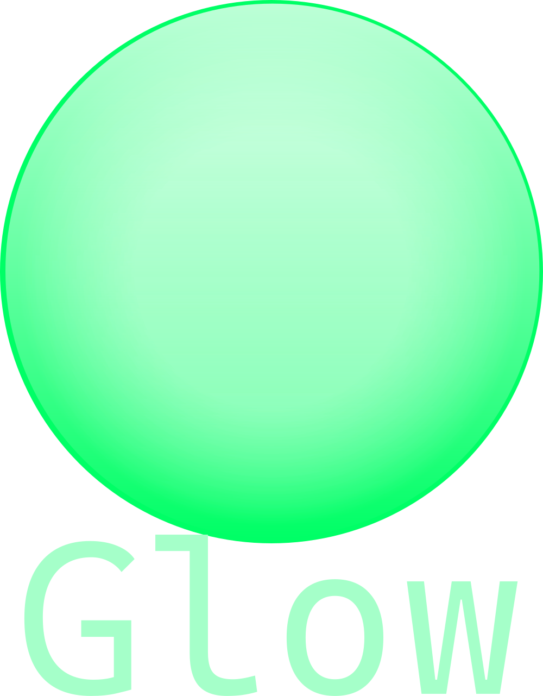

# C++ Library for Windows

- App & WebView2 classes
- Filesystem functions
- Text handling
- Attachable console

## Example usage

### Git submodule:

```pwsh
git submodule add https://github.com/mthierman/Glow.git libs/Glow
```

CMakeLists.txt:

```cmake
add_subdirectory(libs/Glow)

add_executable(
    ${PROJECT_NAME}
    main.cxx
)

target_link_libraries(
    ${PROJECT_NAME}
    PRIVATE
    glow::glow
    glow::glow_compile_features
    glow::glow_compile_options
    glow::glow_settings
)
```

### CMake FetchContent:

```cmake
include(FetchContent)

FetchContent_Declare(
    glow
    URL https://github.com/mthierman/Glow/archive/refs/heads/main.zip
)
FetchContent_MakeAvailable(glow)

add_executable(
    ${PROJECT_NAME}
    main.cxx
)

target_link_libraries(
    ${PROJECT_NAME}
    PRIVATE
    glow::glow
    glow::glow_compile_features
    glow::glow_compile_options
    glow::glow_settings
)
```
