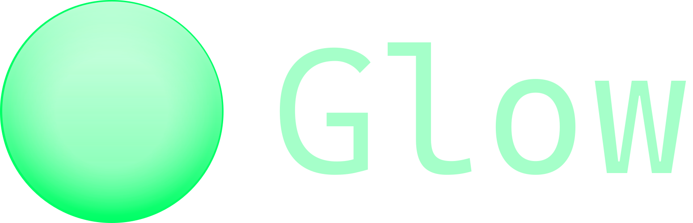

<picture>
    <source media="(prefers-color-scheme: dark)" srcset="./data/banner_horizontal.svg">
    <source media="(prefers-color-scheme: light)" srcset="./data/banner_horizontal.svg">
    
</picture>

# C++ Library for Windows

-   App & WebView2 classes
-   Filesystem functions
-   Text handling
-   Attachable console

## Requirements:

-   C++ 23 Compiler (MSVC/Clang)
-   Nuget package manager CLI
    -   Included with Visual Studio
    -   https://www.nuget.org/downloads
    -   winget CLI (part of App Installer) (https://apps.microsoft.com/detail/9NBLGGH4NNS1)
        -   `winget install Microsoft.NuGet`

## Usage

### Git submodule:

```pwsh
git submodule add https://github.com/mthierman/Glow.git libs/Glow
```

```cmake
add_subdirectory(libs/Glow)

add_executable(
    ${PROJECT_NAME}
    main.cxx
)

target_link_libraries(
    ${PROJECT_NAME}
    PRIVATE
    glow::glow
)
```

### CMake FetchContent:

```cmake
include(FetchContent)

FetchContent_Declare(
    glow
    URL https://github.com/mthierman/Glow/archive/refs/heads/main.zip
)
FetchContent_MakeAvailable(glow)

add_executable(
    ${PROJECT_NAME}
    main.cxx
)

target_link_libraries(
    ${PROJECT_NAME}
    PRIVATE
    glow::glow
)
```

### Compiler flags

To use a recommended set of MSVC/Clang flags, optionally link to `glow::flags`

```cmake
target_link_libraries(
    ${PROJECT_NAME}
    PRIVATE
    glow::glow
    glow::flags
)
```
